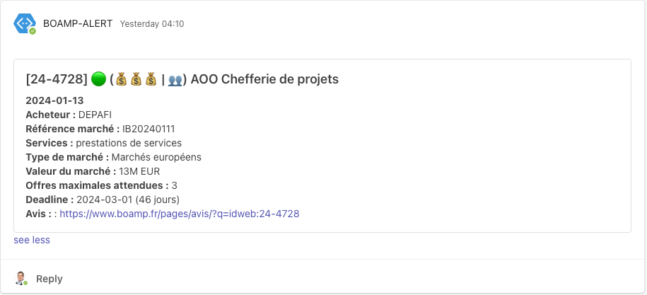

# 🔔 BOAMP Alert

Ce script Python est conçu pour récupérer les données des marchés publics du BOAMP (Bulletin officiel des annonces des marchés publics) via l'API, analyser les données et envoyer des notifications via Microsoft Teams. 
Il est particulièrement utile pour surveiller les appels d'offres publics et les mises à jour associées.

## Fonctionnalités

Récupération des données de l'API BOAMP basée sur une date spécifique.
Analyse des données récupérées pour extraire les informations pertinentes.
Envoi de notifications à Microsoft Teams avec des informations détaillées sur les appels d'offres publics.
Journalisation pour les messages standard, de débogage et d'erreur.
Variables d'environnement pour une configuration flexible.


## Prérequis


- Python 3.10+ 
- Bibliothèques externes : requests, json, pymsteams, datetime, logging, argparse, re, sys, os, load_dotenv


## Installation

1) Assurez-vous que Python 3.10 minimum est installé sur votre système.
2) Installez les paquets Python requis :

```
pip3 install -r requirements.txt
```

3) Clonez ou téléchargez ce script sur votre machine locale.

## Configuration 

1) Créez un fichier .env dans le même répertoire que le script.
2) Ajoutez les variables d'environnement suivantes au fichier .env :

```
# Webhook pour les notifications msteams
WEBHOOK_MARCHE=
WEBHOOK_ATTRIBUTION=
# Mots clefs (cf [.env.sample](.env.sample))
DESCRIPTEURS=
# information visuelle uniquement (valeur 2024-2025)
SEUILMARCHES="221 k€"
# Seuil pour afficher les icones 
MONTANT1=1000000
MONTANT2=2000000
MONTANT3=4000000
# Envoie de la legende tous les 1ers jour du mois
LEGENDE=True
# Nettoyage du répertoire data
JOURS_AVANT_GZIP=7
JOURS_AVANT_EFFACEMENT=30
# Créer un fichier statistiques.json
STATISTIQUES=True
```

Optionnel pour envoyer des notifications pushover.net en cas d'erreur 
```
PUSH_USER=
PUSH_API= 
````

PUSH_* are optional, if you have a PUSHOVER.NET account and want to receive error notification

## Utilisation

- Exécutez le script :

```
python3 boamp.py
```
Le script récupérera automatiquement les données pour la journée précédente.
Des notifications contenant des informations détaillées seront envoyées aux canaux Microsoft Teams configurés.

## Options 

```
python3 boamp.py -h

    ,---.    .---.    .--.           ,---.   
    | .-.\  / .-. )  / /\ \ |\    /| | .-.\  
    | |-' \ | | |(_)/ /__\ \|(\  / | | |-' ) 
    | |--. \| | | | |  __  |(_)\/  | | |--'  
    | |`-' /\ `-' / | |  |)|| \  / | | |     
    /( `--'  )---'  |_|  (_)| |\/| | /(      
    (__)     (_)             '-'  '-'(__) 
            par Julien Mousqueton / Computacenter         
        
usage: boamp.py [-h] [-D] [-n] [-d YYYY-MM-DD] [-s {attribution,ao,rectificatif}] [-l]

Script to fetch and process BOAMP data

options:
  -h, --help            show this help message and exit
  -D, --debug           Active le mode debug (aucun message ne sera envoyé à msteams)
  -n, --now             Force la date du jour au lieu de J-1
  -d YYYY-MM-DD, --date YYYY-MM-DD
                        Spécifie la date du scan au format yyyy-mm-dd
  -s {attribution,ao,rectificatif}, --select {attribution,ao,rectificatif}
                        Selection de la nature de l'avis : 'attribution', 'rectificatif' ou 'ao' (Appel d'Offre)
  -l, --legende         Publie la légende dans le channel des avis de marché
  -m, --motclef         Affiche tous les mots clefs


  ```

## Legende      

💰      Marché supérieur à 1M€*

💰💰    Marché supérieur à 2M€*

💰💰💰  Marché supérieur à 5M€*

💶      Marché européen compris entre 500.0k€** et 1.0M€*

❌       Marché entre 90k€ et 221k€

❌      Marché inférieur à 90k€ (MAPA)

❌      Marché européen inférieur à 500.0k€** 

❓      Marché d'un montant inconnu ou compris entre 221k€ et 1M€*

💿      Marché identifié comme un marché logiciel

🧰      Marché identifié comme un marché de maintenance

👥      Marché identifié comme un marché de prestation de service

🆘       Marché identifié comme un marché de d'assistance

💻      Marché identifié comme un marché de matériel

🖨️       Marché identifié comme un marché de matériel d'impression

♻️        Marché identifié comme un marché de consommables

🟢       Avis de marché

🟠       Modification d'un avis de marché

🏆      Avis d'attribution

>  &#42; Valeur configurarable dans le fichier .env (cf [.env.sample](.env.sample))
>  &#42;&#42; La moitié de la valeur de 💰 (soit 1M€ par défaut)

## Exemple




## Auteur

- [Julien Mousqueton](https://www.github.com/JMousqueton) CTO @ [Computacenter](https://www.computacenter.com)


## Remerciements

 - Mon collègue et ami Guillaume C. pour les idées et surtout la motivation 
 - La communauté Cyber qui m'a permis de me remettre au python avec le projet [Ransomware.live](https://www.ransomware.live)
